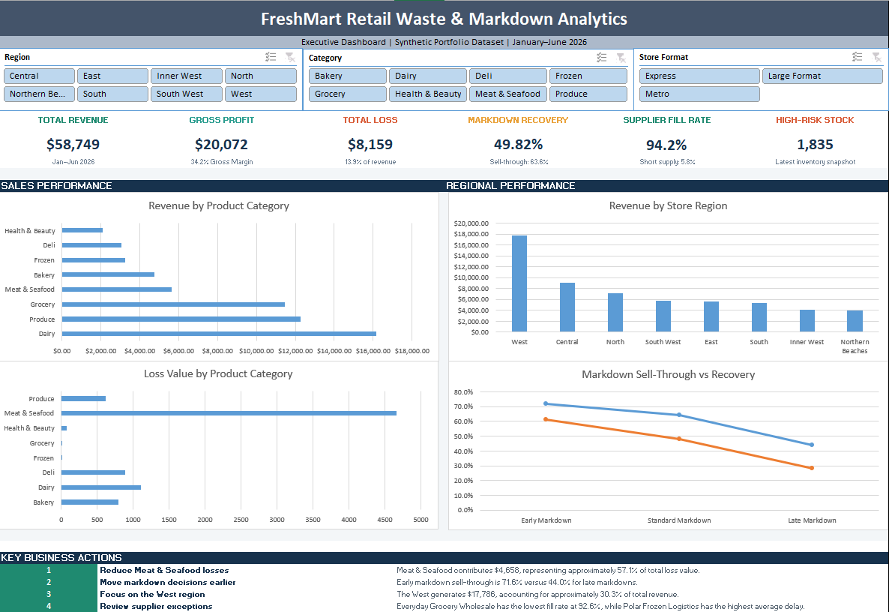

# FreshMart Retail Waste & Markdown Analytics
## Project Overview

This is an end-to-end Excel analytics project I built to analyse retail sales, waste, shrinkage, markdown performance, inventory risk and supplier deliveries.

FreshMart is a fictional Australian grocery retailer and the dataset used in this project is fully synthetic. The main purpose of the project was to practise the complete Excel analytics workflow, starting from raw data and finishing with an interactive dashboard and business recommendations.

The project was built using Excel, Power Query, the Excel Data Model, Power Pivot, DAX, PivotTables, PivotCharts and slicers.

---

## Dashboard Preview



---

## Business Problem

FreshMart is generating sales, but some of its profit is being lost through product waste, shrinkage, poor markdown timing, inventory approaching expiry and supplier delivery issues.

The main goal of this project was to find where those losses were happening and what actions the business could take to reduce them.

---

## Questions I Wanted to Answer

- Which product categories generate the most revenue?
- Which store regions perform best?
- Which categories create the highest waste and shrinkage losses?
- Do early markdowns perform better than late markdowns?
- Which suppliers have low fill rates, delays or damaged deliveries?
- How much stock is currently at high risk of expiry?
- What practical actions could improve performance?

---

## Main KPIs

| KPI | Result |
|---|---:|
| Total Revenue | $58,749 |
| Total Cost | $38,677 |
| Gross Profit | $20,072 |
| Gross Margin | 34.2% |
| Total Loss Value | $8,159 |
| Markdown Recovery Rate | 49.8% |
| Markdown Sell-Through Rate | 63.6% |
| Supplier Fill Rate | 94.2% |
| Supplier Short-Supply Rate | 5.8% |
| High-Risk Inventory | 1,835 units |

---

## Key Findings

### Sales

- Dairy generated the highest revenue at approximately **$16,165**.
- Produce recorded the highest sales volume with **4,535 units sold**.
- The West region generated approximately **$17,786**, which was around **30.3% of total revenue**.

### Waste and Shrinkage

- Total waste and shrinkage loss was approximately **$8,159**.
- Operational waste made up most of the total loss value.
- Meat & Seafood created approximately **$4,658** in losses, which was around **57.1% of total loss value**.

### Markdown Performance

- Early markdowns achieved a **71.6% sell-through rate**.
- Standard markdowns achieved a **64.2% sell-through rate**.
- Late markdowns achieved only a **44.0% sell-through rate**.
- Early markdowns recovered approximately **61.4% of potential full-price value**.
- Late markdowns recovered only **28.1%**.

This showed that waiting too long to mark products down reduced both sell-through and value recovery.

### Supplier Performance

- The overall supplier fill rate was approximately **94.2%**.
- Everyday Grocery Wholesale recorded the lowest fill rate at approximately **92.6%**.
- Red River Meats recorded the highest damage rate.
- Polar Frozen Logistics recorded the highest average delivery delay.

### Inventory Risk

- The latest inventory snapshot identified approximately **1,835 units** as high risk.
- The analysis also showed differences between system stock and physical stock counts.

---

## Business Recommendations

Based on the analysis, I would recommend the following actions:

1. **Use earlier markdown triggers**  
   Early markdowns performed much better than late markdowns, so products approaching expiry should be discounted sooner.

2. **Focus on Meat & Seafood waste**  
   This category created the largest share of total losses and should be reviewed first for ordering, forecasting and expiry control.

3. **Review underperforming suppliers**  
   Suppliers with low fill rates, damaged stock or repeated delays should be monitored against service-level targets.

4. **Create high-risk stock alerts**  
   Stores should regularly receive a list of products approaching expiry so staff can take action before the stock becomes waste.

5. **Review stock count differences**  
   Regular stock variance checks can help identify shrinkage, missed waste records and counting errors.

6. **Study the West region**  
   The West region had the strongest revenue performance, so its sales patterns and store practices could be compared with other regions.

---

## Data Cleaning and Transformation

I imported the raw workbook into Power Query and cleaned each table before loading it into the Excel Data Model.

The main cleaning and transformation steps included:

- Correcting data types
- Trimming spaces
- Standardising category names
- Standardising loss reasons
- Replacing blank promotion flags
- Replacing blank temperature issue flags
- Removing duplicate delivery records
- Creating calculated columns for:
  - Gross profit
  - Gross margin
  - Stock count variance
  - Days to expiry
  - Expiry risk
  - Markdown sell-through
  - Markdown recovery
  - Short-supplied units
  - Supplier damage rate

The original raw workbook was kept separate and was not manually edited.

---

## Data Model

I used a fact and dimension structure inside the Excel Data Model.

### Dimension Tables

- `dim_Products`
- `dim_Stores`
- `dim_Suppliers`

### Fact Tables

- `fact_Sales`
- `fact_Inventory`
- `fact_Losses`
- `fact_Markdowns`
- `fact_Deliveries`

The tables were connected using:

- `Product_ID`
- `Store_ID`
- `Supplier_ID`

This allowed the slicers to filter multiple parts of the dashboard through the shared dimension tables.

---

## DAX Measures

I created DAX measures for the main percentage calculations so they would respond correctly to slicers.

### Markdown Sell-Through Rate

```DAX
DIVIDE(
    SUM('fact_Markdowns'[Units_Sold_on_Markdown]),
    SUM('fact_Markdowns'[Units_Marked_Down]),
    0
)
```

### Markdown Recovery Rate

```DAX
DIVIDE(
    SUM('fact_Markdowns'[Markdown_Revenue]),
    SUM('fact_Markdowns'[Potential_Full_Price_Value]),
    0
)
```

### Supplier Fill Rate

```DAX
DIVIDE(
    SUM('fact_Deliveries'[Delivered_Units]),
    SUM('fact_Deliveries'[Ordered_Units]),
    0
)
```

### Short-Supply Rate

```DAX
DIVIDE(
    SUM('fact_Deliveries'[Ordered_Units]) -
    SUM('fact_Deliveries'[Delivered_Units]),
    SUM('fact_Deliveries'[Ordered_Units]),
    0
)
```

---

## Dashboard Features

The final dashboard includes:

- Six KPI cards
- Revenue by product category
- Revenue by store region
- Loss value by product category
- Markdown sell-through and recovery comparison
- Region slicer
- Product category slicer
- Store format slicer
- Interactive PivotCharts
- Business actions based on the analysis

---

## Tools Used

- Microsoft Excel
- Power Query
- Excel Data Model
- Power Pivot
- DAX
- PivotTables
- PivotCharts
- Excel slicers
- Git
- GitHub

---

## Repository Structure

```text
freshmart-retail-waste-analytics
│
├── data
│   └── raw
│       └── FreshMart_Retail_Waste_Markdown_RAW_DATA_ONLY.xlsx
│
├── workbook
│   └── FreshMart_Retail_Waste_Analytics_Project.xlsx
│
├── screenshots
│   └── Dashboard.png
│
└── README.md
```

---

## How to Use the Project

1. Download or clone the repository.
2. Open:

```text
workbook/FreshMart_Retail_Waste_Analytics_Project.xlsx
```

3. Enable workbook content if Excel asks.
4. Use the slicers to filter the dashboard by:
   - Region
   - Product category
   - Store format
5. Use **Data → Refresh All** to refresh the workbook.

### Power Query Source Path

The workbook may still use the original file location from the computer where it was created.

To refresh it on another computer:

1. Open Power Query.
2. Select **Data Source Settings**.
3. Change the source to:

```text
data/raw/FreshMart_Retail_Waste_Markdown_RAW_DATA_ONLY.xlsx
```

---

## Dataset Disclaimer

This project uses synthetic data created only for learning and portfolio purposes.

FreshMart is a fictional business. The dataset does not contain real customer, employee, supplier or commercial information.

---

## Limitations

- The data covers a limited synthetic reporting period.
- Weather, holidays, competitor pricing and external market conditions are not included.
- Inventory is based on weekly snapshots rather than real-time stock levels.
- The recommendations are based only on the available synthetic data.

---

## Project Status

**Complete**

The final project includes:

- Raw synthetic data
- Power Query cleaning and transformation
- Excel Data Model relationships
- DAX measures
- PivotTable analysis
- Interactive dashboard
- Business findings and recommendations

---

## Author

**Shirish Man Shakya**

Data Analyst | Data Science Graduate

- GitHub: [Shakya658](https://github.com/Shakya658)
- Portfolio: [shakya658.github.io/portfolio](https://shakya658.github.io/portfolio)
